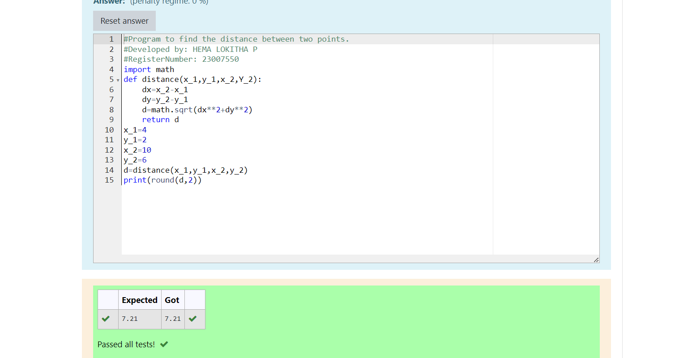

# DISTANCE-BETWEEN-TWO-POINTS

## AIM:
To write a python program to find the distance two 2 points
## ALGORITHM:
### Step 1: 
### Step 2: 
### Step 3: 
Substitute the values in the distance formula  
### Step 4: 
### Step 5: 
### PROGRAM:
# Program to find the distance between two points.
# Developed by: HEMA LOKITHA P
# RegisterNumber: 23007550
import math
def distance(x_1,y_1,x_2,Y_2):
    dx=x_2-x_1
    dy=y_2-y_1
    d=math.sqrt(dx**2+dy**2)
    return d
x_1=4
y_1=2
x_2=10
y_2=6
d=distance(x_1,y_1,x_2,y_2)
print(round(d,2))

### OUTPUT:

### RESULT:
completed successfully!